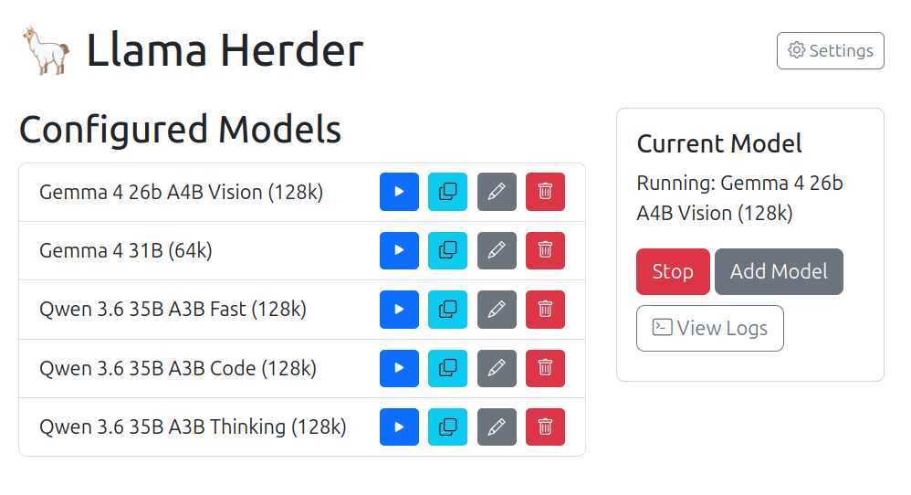

# 🦙 Llama Herder

A Flask-based web interface to manage and launch [llama.cpp](https://github.com/ggml-org/llama.cpp) server instances for multiple GGUF models. Switch between models with one click, each with its own custom configuration.



## Features

- 🚀 Start/stop llama-server instances with one click
- 💾 Save and manage multiple model configurations
- ✏️ Edit, copy, and delete configurations
- 👁️ View currently running model status
- 🔍 Vision models supported via mmproj files

## Requirements

- **llama.cpp** — A compiled [llama.cpp](https://github.com/ggml-org/llama.cpp) with `llama-server` built. This is the only hard dependency — Llama Herder is just a UI wrapper around it.
- **Python 3.8+**
- **GGUF model files** — Download from [Hugging Face](https://huggingface.co/models?search=gguf) (filter by format "gguf"). Look for repos from organizations like `bartowski`, `TheBloke`, `Qwen`, `HuggingFaceTB`, etc.

## Installation

### 1. Install llama.cpp

Follow the [llama.cpp build instructions](https://github.com/ggml-org/llama.cpp#build) for your platform. You need the `llama-server` binary:

```bash
git clone https://github.com/ggml-org/llama.cpp.git
cd llama.cpp
cmake -B build
cmake --build build --config Release --parallel
```

The `llama-server` binary will be in `build/bin/` (Linux/macOS) or `build\bin\Release\llama-server.exe` (Windows).

### 2. Install Llama Herder

Clone the repo and install dependencies:

```bash
git clone https://github.com/patw/llama-herder.git
cd llama-herder
```

**Using pip:**
```bash
pip install -r requirements.txt
```

**Using uv:**
```bash
uv pip install -r requirements.txt
```

### 3. Download a model

Grab a GGUF model from Hugging Face. For example:

```bash
# Qwen 2.5 7B
huggingface-cli download Qwen/Qwen2.5-7B-Instruct-GGUF qwen2.5-7b-instruct-q4_k_m.gguf \
  --local-dir models/

# Or Gemma 2 2B
huggingface-cli download google/gemma-2-2b-it-gguf gemma-2-2b-it-q4_k_m.gguf \
  --local-dir models/
```

## Usage

### Start the app

```bash
python app.py
```

Then open `http://localhost:5000` in your browser.

### First-time setup

1. Click **Add Model** and give it a name, the path to your GGUF file, and any parameters.
2. Click **Edit defaults** to set the path to your `llama-server` binary and any default command-line options (threads, GPU layers, host, port, etc.).
3. Click **Start** on a model to launch it. The status card shows which model is running — click **Stop** to terminate.

### Model fields

| Field | Description |
|---|---|
| **Model Name** | Display name shown in the UI |
| **GGUF File Path** | Absolute or relative path to the `.gguf` model file |
| **MMProj File Path** | Optional vision projectors (clip vision models). Leave blank for text-only models |
| **Additional Parameters** | Extra `llama-server` flags for this model (temperature, context size, top-k, etc.) |

### Defaults

Set these once in **Edit defaults**:

| Field | Description |
|---|---|
| **llama-server path** | Full path to your `llama-server` binary |
| **Default options** | Shared flags like `--host 0.0.0.0 --port 8086 -t 8 --ngl 99` |
| **Default model path** | Base directory for resolving relative model paths |

## Data storage

Configurations are stored in MooFile databases (`models.bson` / `defaults.bson`) — a lightweight, embedded, single-file document store. No server or external database required.

## License

MIT License - See [LICENSE](LICENSE) file for details.
