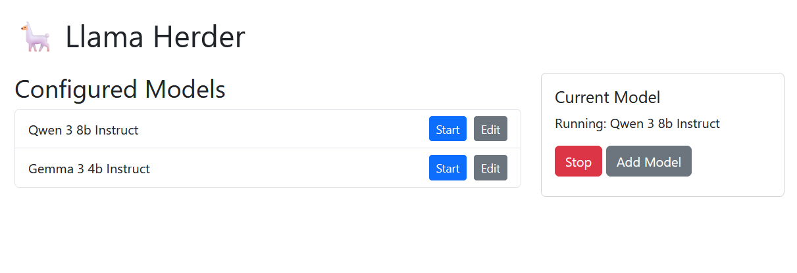

# 🦙 Llama Herder - Windows GUI for llama.cpp server

A simple Flask-based web interface to manage multiple models for llama-server.exe on Windows.  This is useful if you run multiple models and need to switch frequently.  Each model can get it's own custom configuration.



## Features

- 🚀 Start/stop llama-server.exe instances with one click
- 💾 Save multiple model configurations
- ✏️ Edit existing configurations
- 👀 View currently running model status

## Requirements

- Windows 10/11 (64-bit)
- Python 3.8+
- [llama.cpp](https://github.com/ggerganov/llama.cpp) compiled for Windows (llama-server.exe)
- GGUF model files

## Installation

1. **Clone this repository**
```bash
git clone https://github.com/patw/llama-herder.git
cd llama-herder
```

2. **Install dependencies**
```bash
pip install -r requirements.txt
```

3. **Configure your environment**
   - Edit `.env` file with your paths:
```ini
LLAMA_SERVER=C:\path\to\llama-server.exe
DEFAULT_OPTIONS=-t 6 -ngl 99 --host 0.0.0.0 --port 8086
```

4. **Add your GGUF models**
   - Place your model files in a known location
   - Add them through the web interface

## Usage

1. **Start the application**
```bash
python app.py
```

2. **Access the web interface**
   - Open `http://localhost:5000` in your browser

3. **Manage your models**
   - Click "Add Model" to create new configurations
   - Use Start/Stop buttons to control the server
   - Edit existing configurations as needed

## Configuration Options

Key parameters you can set:
- `-t`: Threads
- `-ngl`: GPU layers
- `--ctx-size`: Context size
- `--temp`: Temperature
- `--top-k`, `--top-p`: Sampling parameters

## Troubleshooting

**Common issues:**
- Make sure llama-server.exe path is correct in `.env`
- Ensure your GGUF model paths are accessible
- Check firewall settings if having connection issues
- Verify you have enough VRAM for the model

## Development

To run in development mode:
```bash
set FLASK_DEBUG=1
python app.py
```

## License

MIT License - See [LICENSE](LICENSE) file for details.

